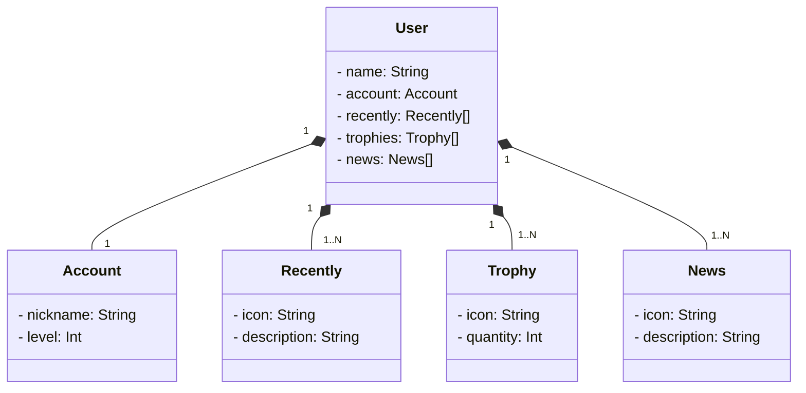

# Santander API Project 

## Diagrama de Classes 

```mermaid
classDiagram
  class User {
    - name: String
    - account: Account
    - recently: Recently[]
    - trophies: Trophy[]
    - news: News[]
  }
  
  class Account {
    - nickname: String
    - level: Int
  }
  
  class Recently {
    - icon: String
    - description: String
  }
  
  class Trophy {
    - icon: String
    - quantity: Int
  }
  
  class News {
    - icon: String
    - description: String
  }
  
  User "1" *-- "1" Account
  User "1" *-- "1..N" Recently
  User "1" *-- "1..N" Trophy
  User "1" *-- "1..N" News

```
